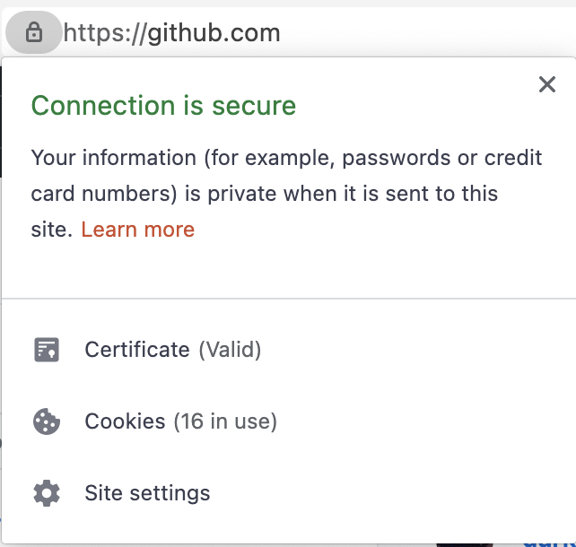

I was feeling hungry that day, but I never imagined that I could end up liked I did. Knowing all that I know today, next time I will be more careful.

If you're here thinking: **'how can someone eat some much!! 🤯'** I'm sorry to tell you that the title was just clickbait. (Although I do eat a lot of real cookies )

In this post, I'm going to show how cookies on sites have gone wild.

I'm not new to cookies nor privacy issues on the internet, but a few days ago I was surprised when I accidentally saw how many cookies outlook was using when I opened my email.

> I'm not saying that cookies count has a direct relation with privacy. But I'm surprised at how many each site ends up installing.

Some context before I post the screenshots:

- I live in Europe, so the GDPR banners are shown on almost every site and I accepted the default cookie options.
- I was logged in to some sites.

Here's the list, ordered from biggest to smallest (screenshots below list):

| # | site | Cookies installed | Screenshot |
|---|---|---|---|
|1|Outlook|57 👑👑||
|2|Buzzfeed|53||
|3|Gmail|39||
|4|Trello|30||
|5|Upwork|29||
|6|Amazon|28||
|7|AWS|28||
|8|LinkedIn|27||
|9|Airbnb|26||
|10|Apple|24||
|11|TechCrunch|22||
|12|YouTube|22||
|13|Meetup|22||
|14|Spotify|21||
|15|Cnet|20||
|16|Twitter|19||
|17|Atlassian|19||
|18|MSN|17||
|19|Yahoo|16||
|20|DigitalOcean|16||
|21|Google|16||
|22|Github|16||
|23|Instagram|15||
|24|Facebook|12||
|25|dev.to|4||
|26|HackerNews|3||
|27|GetAdvice|1 (this is my site. I had to do it, sorry 😇)||

*Photo credits: [https://www.pexels.com/@leigh-patrick-14477](https://www.pexels.com/@leigh-patrick-14477)*